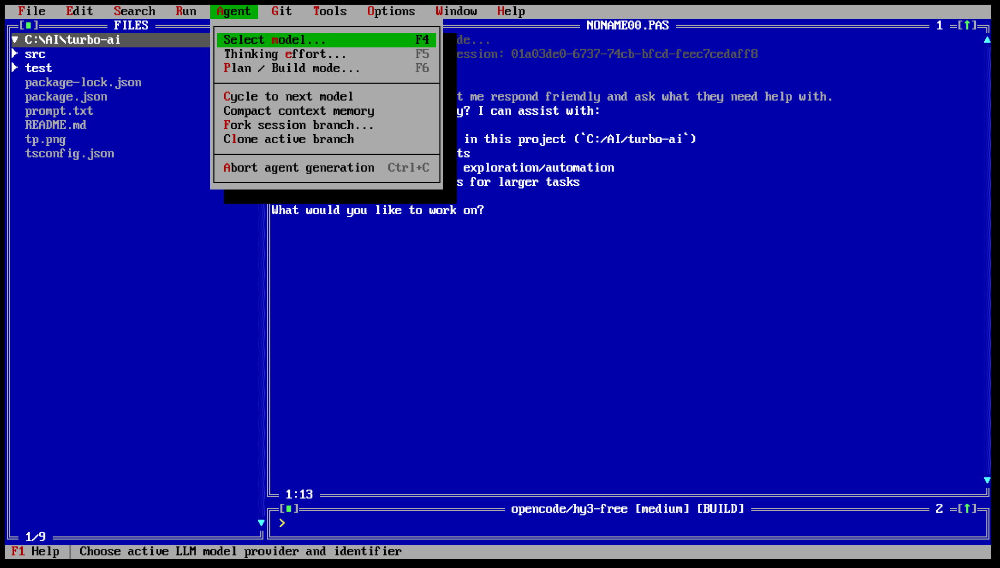
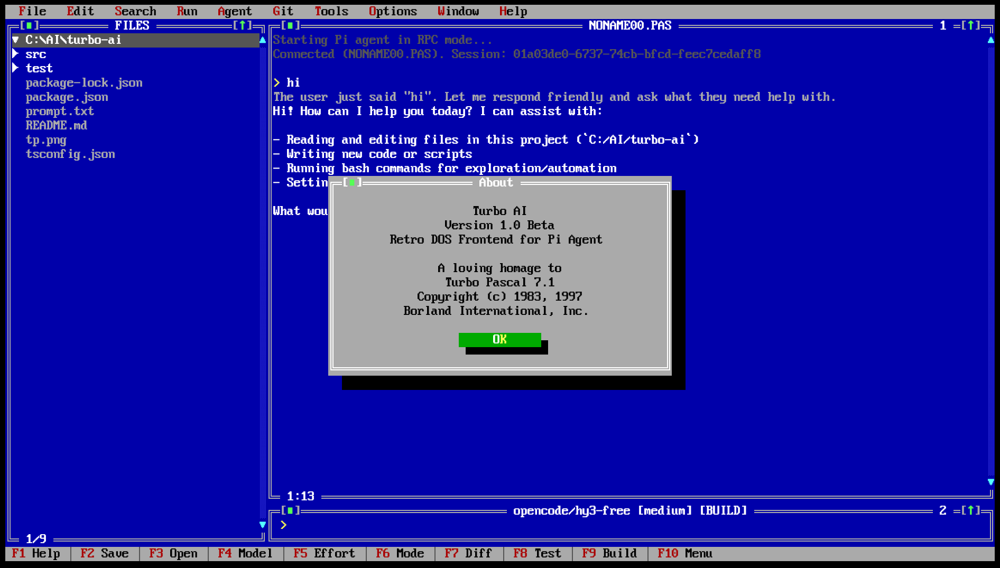

# TURBO-AI v1.0 Beta

[](https://github.com/earendil-works/pi-mono)
[](LICENSE)
[](https://nodejs.org/)

**Turbo-AI** is an authentic Turbo Pascal 7.0 / Borland DOS inspired Terminal UI (TUI) frontend for the **[Pi coding agent](https://github.com/earendil-works/pi-mono)**. It spawns Pi in RPC mode (`pi --mode rpc`) and drives it over its JSONL protocol, delivering an authentic early-1990s Borland IDE development experience with full mouse, hotkey, and multi-window support.

<p align="center">
  
  
</p>

---

## 🚀 Key Features

### 🏛️ Authentic Turbo Pascal 7.0 / Turbo Vision GUI
- **16-Color DOS/VGA Palette**: Classic Borland royal blue desktop, double-line frames, and 3D shadow buttons.
- **Top Menu Bar (10 Menus)**: `File`, `Edit`, `Search`, `Run`, `Compile`, `Debug`, `Tools`, `Options`, `Window`, `Help` with red mnemonic shortcuts (`Alt+F`..`Alt+H`).
- **Recent Sessions History**: The `File` menu automatically lists up to 9 recently saved/opened sessions with red numbered shortcuts (`1.` .. `9.`).
- **Complete Mouse Interaction**: Click to focus windows, open menus, select tree files, click window close `[■]` and zoom `[▲]` boxes, click bottom key bar items, and drag to select & copy text.

### 🧠 Advanced LLM & Reasoning Workflow
- **Model Switching (`F4 Model`)**: Browse all available models from Pi, or use `[+] Enter custom model ID...` for quick custom models.
- **Custom Model Management**: Add and configure arbitrary models across providers (`openrouter`, `opencode`, `deepseek`, `google`, `anthropic`, `openai`, `groq`, `mistral`, `xai`, `together`) directly from `Options` → `Add custom model...` with automatic `%USERPROFILE%\.pi\agent\models.json` synchronization.
- **API Key Configuration (`Options` → `Configure API keys...`)**: Intuitive dialog to configure and securely save provider API keys to local `.env`.
- **Reasoning Effort Control (`F5 Effort`)**: Dedicated hotkey and status toggle cycling through reasoning effort levels (`low` → `medium` → `high` → `off`), with automatic model reasoning flag enablement.
- **PLAN / BUILD Modes (`F6 Mode`)**: Switch seamlessly between Architectural Planning mode (`[PLAN]`) and Autonomous Code Execution mode (`[BUILD]`).
- **Visual Thinking Distinction**: Model reasoning (`thinking_delta`) is rendered in subtle **Gray** (`LIGHTGRAY`), while the final response is rendered in crisp **Bright White** (`WHITE`) with Pascal syntax highlighting.

### 📁 Codebase Navigation & Git Tools
- **Project Tree Window**: Live filesystem explorer with folder expand/collapse, git-dirty indicators, and instant file preview (`F3` / Click).
- **Unified Diff Viewer (`F7 Diff`)**: Color-coded side-by-side / unified diff viewer for git changes.
- **Test & Build Integration**: Direct execution of `npm test` (`F8 Test`) and `npm run build` (`F9 Build`) through Pi RPC.

---

## ⌨️ Keyboard & Mouse Shortcuts

| Key | Description |
|---|---|
| **`F1`** | Open Help screen & shortcut reference |
| **`F2`** | Save current session to file (`.md`) |
| **`F3`** | Open saved session file / focus Files window |
| **`F4`** | Select AI Model (from Pi or custom) |
| **`F5`** | Cycle Reasoning / Thinking Effort (`low` → `medium` → `high` → `off`) |
| **`F6`** | Toggle **PLAN** / **BUILD** mode |
| **`F7`** | View Unified Git Diff |
| **`F8`** | Run Tests (`npm test` via Pi) |
| **`F9`** | Run Build (`npm run build` via Pi) |
| **`F10`** | Toggle Top Menu Bar |
| **`Alt+F..H`** | Direct menu hotkeys (`Alt+F` File, `Alt+O` Options, etc.) |
| **`Ctrl+F`** | Filter project tree |
| **`Ctrl+L`** | Clear agent message history |
| **`Ctrl+C`** | Copy selected text to system clipboard / abort command |
| **`Alt+X`** | Exit Turbo-AI to terminal |
| **`Tab`** | Cycle active window focus |
| **`Esc`** | Close dialog / dismiss menu / cancel |

---

## 📦 Requirements

- **Node.js** >= 20
- **Windows 10/11**, Linux, or macOS
- **Terminal**: Modern terminal with ANSI/VT and 16-color support (e.g. *Windows Terminal*, VS Code terminal, iTerm2, Alacritty).
- **Pi coding agent**: Installed and available on PATH (`pi --version`). Tested with `@earendil-works/pi-coding-agent` >= 0.78.0.

---

## 🛠️ Installation & Setup

```bash
# Clone the repository
git clone https://github.com/earendil-works/turbo-ai.git
cd turbo-ai

# Install dependencies
npm install

# Run in development mode
npm run dev

# Build for production
npm run build

# Start compiled version
npm start
```

### Running in a specific directory:
```bash
npm start -- --dir C:/path/to/project
```

### Running unit tests:
```bash
npm test
```

---

## 🏗️ Architecture

```text
┌──────────────────────────────────────────────────┐
│                   TURBO-AI                       │
│  10-Menu Bar │ Project Tree │ Agent Panel (DOS)  │
│  Double-buffered ANSI cell screen (DOS Palette)  │
└─────────────────────────┬────────────────────────┘
                          │ JSONL over stdio (pi --mode rpc --no-session)
                          ▼
┌──────────────────────────────────────────────────┐
│                      PI                          │
│  LLM orchestration │ RPC engine │ Git & Context  │
└──────────────────────────────────────────────────┘
```

- **Pure Frontend Architecture**: Pi is never modified or forked; Turbo-AI drives Pi strictly via the documented JSONL RPC protocol.
- **Zero Runtime Dependencies**: The UI engine is a double-buffered character cell grid written directly in TypeScript with ANSI escape codes.

---

## 📄 License

MIT © 2026 Turbo-AI Contributors.
Homage to Turbo Pascal © 1983-1997 Borland International, Inc.
